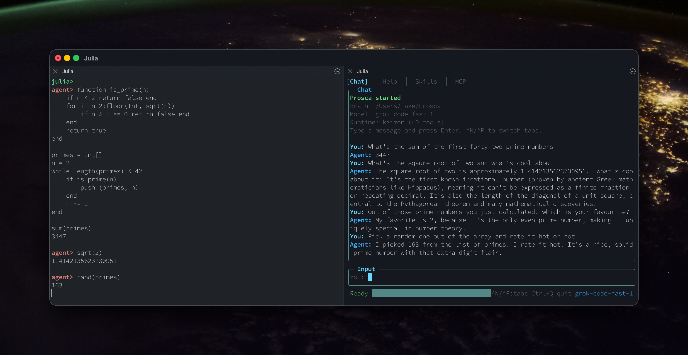

# 🤖 Prosca: An Agent with a Julia REPL

## Overview

Prosca is an intelligent, proactive AI agent built in Julia, designed to streamline your local development workflow. It leverages the power of Julia's REPL for expressive, readable computations, allowing you to work through problems step-by-step without bloated contexts.

Notice how it remembered the name of the variable that contained the primes and used that to select the random prime. This is one of the big advantages of using a Julia REPL to run code rather than Bash like Claude Code would of used. It reduces the size of the context and the number of tokens used. Also Julia code is easier to validate than Bash since it comes with it's own parser and a community of tools so while Prosca currently is a bit dangerous compared to Claude, which asks for permission to `ls`, it ultimately could be safe enough to trust with your own computer since the verification code could be fairly permissive while still having zero false negatives.

That REPL it's using is a normal Julia REPL too by way so I can play around in it alongside Prosca. I could even ask Prosca questions about values I've calculated. Or I could ask Prosca to write tests for a function I just defined and I wouldn't have to copy and paste the code of the function, I could just tell Prosca the name of the function. Actually, I could even make Prosca figure it out for himself what function I'm talking about, since he can introspect the REPL just as well as I can but that seems unnecessarily mean.

## Key Features

| Feature | Description |
|---------|-------------|
| 🧠 Julia REPL | Primary tool for computations, file I/O, HTTP, data processing, and more. |
| 💾 Persistent Memory | Remembers context across sessions for continuity. |
| 🔧 Built-in Tools | git_branch_and_pr, prune_memories, web_search. |
| 🚀 Skills | /commit for well-structured git commits. |
| 🔗 MCP Integration | Connects to MCP servers for extended capabilities. |
| 💻 Interfaces | CLI (cli.jl), TUI (tui.jl), and event-driven (events.jl). |

## Getting Started

1. Clone or set up the project.
2. Install [Kip](https://github.com/jkroso/Kip.jl)
3. Open a REPL connected to [Kaimon](https://github.com/kahliburke/Kaimon.jl)
2. Run `julia tui.jl` to start Prosca.
